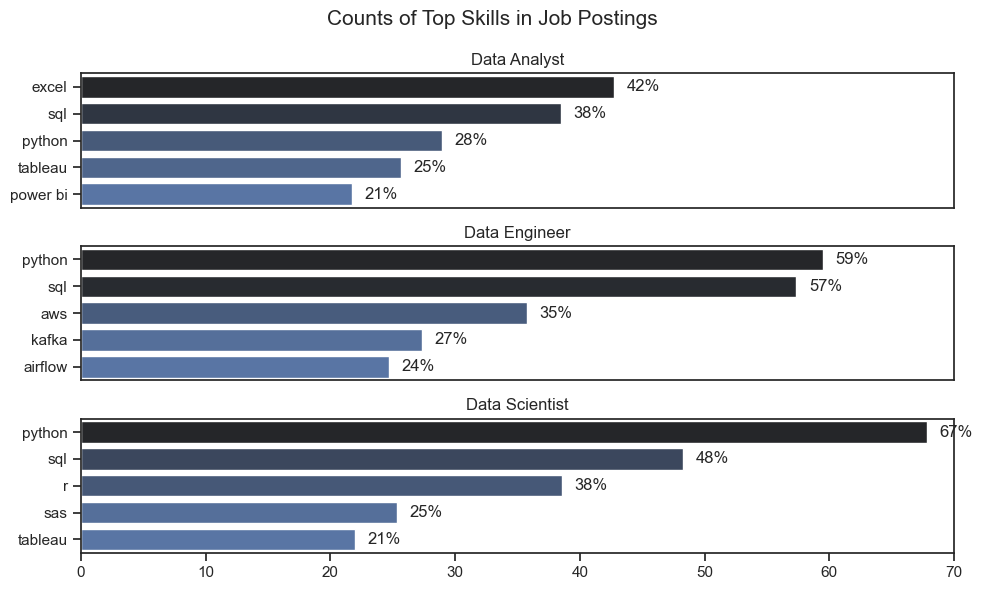
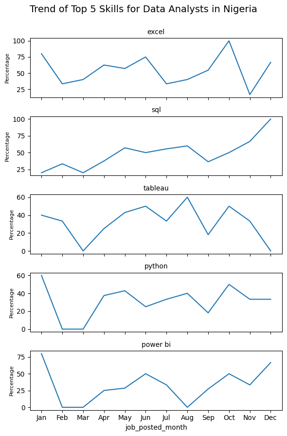
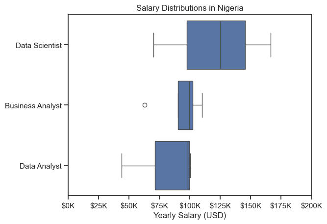
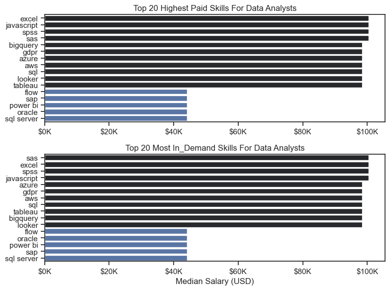

# Analysis of Job Posting Trends for Data-Related Roles in Nigeria

## Overview

In this project, I analyzed the data analytics job market in Nigeria to uncover trends in skill demands, salary distributions, and career optimization strategies for aspiring and experienced data professionals. The aim was to identify the most in-demand skills, understand how these skills are trending, and explore the relationship between market demand and compensation to provide actionable insights for career growth in data analytics.

## Background
The analysis focuses on answering critical questions about the data analytics job market:

- What are the most demanded skills for the top 3 most popular data roles?
- How are in-demand skills trending for Data Analysts?
- How well do jobs and skills pay for Data Analysts?
- What is the most optimal skill to learn for Data Analysts?

By addressing these questions, I aim to help professionals and aspiring data professionals prioritize skills for their career development.

## Tools Used
- Python: The backbone of my analysis, used for data analysis and processing, with the following libraries:

  - Pandas: For data manipulation.
  -  Matplotlib: For creating detailed visualizations.
  - Seaborn: For advanced and aesthetically pleasing visualizations.
- Visual Studio Code (VS Code): Used as my development environment for iterative analysis and code documentation.
- GitHub: Utilized for sharing and version-controlling my Python code.

## Methodology & Process
#### Data Collection and Preparation
#### Data Source
The dataset used in this project was obtained from the Hugging Face Datasets repository, titled "data_jobs" by Luke Barousse. While the original dataset includes job postings from various countries, I filtered it specifically for job postings in Nigeria to focus on trends and insights relevant to the Nigerian job market.

All credit for the dataset goes to the original creator, and I extend my gratitude to Hugging Face for making it accessible for analysis.
#### Analysis Approach
- Box plots: Used to analyze salary distributions and identify high-paying roles.
- Parallel bar charts: Implemented to compare skill demands across roles.
- Line plots: Visualized skill trends over time for Data Analysts.
- Comparative analysis: Conducted to evaluate the relationship between skill demand and compensation.


## Analysis

### 1. What are the most demanded skills for the top 3 most popular data roles?
### Methodology
To find the most demanded skills for the top 3 data roles, I filtered out the most popular and in-demand positions and identified their top 5 skills. This approach highlights the key job titles and their required skills, helping determine which ones to prioritize depending on the role the candidate is applying for.

View my notebook with detailed stepps here:[Skill_Count.ipynb](Skill_Count.ipynb)


### Visualize Data

```python
# Create subplots for each skill
fig, ax = plt.subplots(len(job_titles), 1, figsize=(10, len(job_titles) * 2)) 
sns.set_theme(style='ticks')

# Plot each skill on its own subplot
for i, job_title in enumerate(job_titles):
    df_plot = df_skills_perc[df_skills_perc['job_title_short'] == job_title].head(5)
    sns.barplot(data=df_plot, x='skill_percent', y='job_skills', ax=ax[i], hue='skill_count', palette='dark:b_r')
    ax[i].set_title(job_title)
    ax[i].set_ylabel('')
    ax[i].set_xlabel('')
    ax[i].legend().set_visible(False)
    ax[i].set_xlim(0, 70)

    for n, v in enumerate(df_plot['skill_percent']):
        ax[i].text(v + 1, n, f'{int(v)}%', va='center')

    if i != len(job_titles) - 1:
        ax[i].set_xticks([])


fig.suptitle('Counts of Top Skills in Job Postings', fontsize=15)
fig.tight_layout()


plt.show()
```

### Results
#### Visualization of Top Skills for Data Related Roles



### Insights

#### Common Core Skills Across All Roles
Python is the dominant skill across all three roles, emphasizing its versatility for data manipulation, analysis, and machine learning.
SQL is consistently critical for all roles, as database querying and management are fundamental to working with data.
Tools for data visualization (e.g., Tableau, Power BI) play a significant role, particularly for Data Analysts and Data Scientists, as presenting insights effectively is key.

#### Role-Specific Insights
Data Analyst

- Excel (42%) remains a vital tool for basic data analysis and reporting, especially in entry-level roles.
- SQL (38%) also remains a key tool for data analysis and data querying.
- Tableau (25%) and Power BI (21%) are heavily emphasized, showcasing the - importance of visualization for business-oriented insights.
- Analysts need to balance technical skills with business acumen for effective storytelling.

Data Engineer

- Engineering roles prioritize data infrastructure, with AWS (35%), Kafka (27%), and Airflow (24%) representing modern data pipeline and cloud solutions.
- While Python and SQL dominate, engineers are more focused on scalable solutions and automation.
- The role bridges the gap between raw data and usable datasets for analysts and scientists.

Data Scientist

- Python (67%) and R (38%) are crucial for advanced statistical analysis and machine learning tasks.
- SAS (25%) highlights the use of industry-specific tools for complex data analysis.
- A growing emphasis on visualization tools like Tableau (21%) suggests that Data Scientists are expected to communicate their findings effectively.


### 2. How are In-demand Skills Trending For Data Analyst
### Methodology

To analyze in-demand skills for data analysts in 2023, I extracted job posting data showing the percentage of mentions for key skills each month. After cleaning and preprocessing the data, I visualized the trends using line plots, where each skill (Excel, SQL, Tableau, Python, Power BI) was plotted on a separate subplot to capture monthly variations. This approach allowed me to identify seasonal spikes, consistent demand, and shifts in skill popularity over time. By analyzing these trends, I gained insights into the most sought-after skills for data analysts, highlighting core tools like Excel and SQL, with growing demand for visualization tools like Tableau and Power BI.

### Visualize Data
```python
# Create subplots for each skill
fig, ax = plt.subplots(5, 1, figsize=(6, 10), sharex=True) 

# Plot each skill on its own subplot
for ax, column in zip(ax, df_plot.columns):
    sns.lineplot(data=df_plot, x=df_plot.index, y=column, ax=ax)
    ax.set_title(column, fontsize=10)  
    ax.set_ylabel('Percentage', fontsize=8)  
    ax.grid(False)  

fig.suptitle('Trend of Top 5 Skills for Data Analysts in Nigeria', fontsize=14, y=0.92)  

plt.tight_layout(rect=[0, 0.03, 1, 0.92])  
plt.show()

```

### Results
#### Trend of Top 5 Data Analyst Skills in Nigeria



### Insights

#### 1. Based on the trends:

- Excel remains the most consistently demanded skill, with significant peaks in September and November. This highlights its continued importance for day-to-day data analysis and reporting tasks.
- SQL shows a steady rise throughout the year, culminating in a sharp increase towards the end of the year (December). This indicates growing demand for database querying and management skills.
- Tableau and Power BI have moderate but consistent demand, reflecting the importance of data visualization tools for storytelling and decision-making.
- Python trends upward mid-year, showcasing its importance for advanced data analysis and automation tasks.

#### 2. Seasonal Trends Observed

- Early Year (January to March):
Demand for most skills starts low in January but begins to pick up by March, with SQL and Excel showing noticeable growth.

- Mid-Year (June to August):
During the middle of the year, Tableau, Python, and Power BI see fluctuations, possibly due to varied hiring cycles. Excel continues to maintain steady popularity.

- Late Year (September to December):
A significant spike in demand for SQL and Excel is observed, with Power BI also gaining traction. This could reflect an end-of-year push for project completions or fiscal planning.

### Key Insights

####  Common Core Skills:

- SQL and Excel are foundational across the year, indicating their indispensability for data analysts.
Visualization tools like Tableau and Power BI remain essential, especially for presenting insights to non-technical stakeholders.
- Evolving Role of Python: Python's mid-year spike may correlate with increasing automation, machine learning, and advanced analytics requirements in analyst roles.
- Visualization Emphasis:
Tableau and Power BI trends reveal the growing importance of visual storytelling, especially in business-focused analytics roles.

### 3. How Well do Jobs and Skills Pay for Data Analysts?

### Salary Analysis for Data Professionals
#### Methodology
The analysis utilized box plot visualization techniques to compare salary distributions across the top three data professional roles (Data Scientists, Business Analysts, and Data Analysts) in Nigeria, with salaries represented in USD ranging from $0K to $200K annually. The visualization employs standard box plot elements including median lines, interquartile ranges (IQR) showing the middle 50% of salaries, whiskers indicating minimum and maximum non-outlier values, and individual points representing outliers to provide a comprehensive view of salary distributions. The comparative structure allows for clear identification of salary ranges, medians, and variability between different data professional roles, enabling insights into career progression and market value assessment within Nigeria's data professional landscape.


### Visualize Data

```python
#Create a boxplot
sns.boxplot(data = df_ng_top3, x = 'salary_year_avg', y = 'job_title_short', order = job_order)
sns.set_theme(style = 'ticks')

plt.title('Salary Distributions in Nigeria')
plt.xlabel('Yearly Salary (USD)')
plt.ylabel('')
plt.xlim(0, 200000)

# Format x-axis labels as thousands 
ticks_x = plt.FuncFormatter(lambda y, pos: f'${int(y/1000)}K')
plt.gca().xaxis.set_major_formatter(ticks_x)
plt.show()

```
### Results
#### Salary Analysis for Top 3 Data Professional Roles in Nigeria


### Insights:

#### 1. Salary Ranges
- Data Scientists show the highest median salary and widest salary range
- Business Analysts have the most compact salary range, suggesting more standardized compensation
- Data Analysts show a moderate range, positioned between the other two roles

#### 2. Comparative Analysis
- There's clear salary differentiation between roles
- Data Scientists command premium compensation
- Business Analysts show less salary variability
- Data Analysts have good earning potential but generally lower than Data Scientists

### Key Insights:

#### 1. Career Progression
- The visualization suggests a natural career progression path from Data Analyst to Data Scientist, with corresponding salary increases
- Data Science appears to be the most financially rewarding specialization

#### 2. Market Value
- All three roles command respectable salaries in the Nigerian market
- The presence of outliers suggests opportunities for higher compensation in certain circumstances
- Business Analyst role shows the most consistent compensation structure

#### 3. Entry Points
- Data Analyst positions may serve as a good entry point into the data profession
- The overlap in salary ranges suggests skills and experience significantly influence compensation

### What is the Most Optimal Skill to Learn for Data Analysts?
### Methodology
The analysis utilizes parallel bar chart visualization to compare the top 20 skills in two dimensions: compensation and market demand. Each chart displays median salaries in USD, with skills ranked by both earning potential and demand level, providing a comprehensive view of skill value in the data analytics job market.

### Visualize Data

```python
fig, ax = plt.subplots(2, 1, figsize=(8, 6))
sns.set_theme(style="ticks")


# FOR TOP PAY
sns.barplot(data =df_da_top_pay, x = 'median', y = df_da_top_pay.index, ax = ax[0], hue = 'median', palette = 'dark:b_r')   #-----  _r is to reverse the arrangement of the color
ax[0].legend().remove()


#formating
ax[0].set_title('Top 20 Highest Paid Skills For Data Analysts')
ax[0].set_ylabel('')
ax[0].set_xlabel('')
#to format x axis to k instead of thousand
ax[0].xaxis.set_major_formatter(plt.FuncFormatter(lambda x, _: f'${int(x/1000)}K'))

# FOR TOP SKILLS
sns.barplot(data =df_da_skills, x = 'median', y = df_da_skills.index, ax = ax[1], hue = 'median', palette = 'dark:b_r')
ax[1].legend().remove()

#formating
ax[1].set_title('Top 20 Most In_Demand Skills For Data Analysts')
ax[1].set_ylabel('')
ax[1].set_xlabel('Median Salary (USD)')
#to format x axis to k instead of thousand
ax[1].xaxis.set_major_formatter(plt.FuncFormatter(lambda x, _: f'${int(x/1000)}K'))

fig.tight_layout()
#plt.subplots_adjust(hspace=0.35)  # Increase space between subplots

#make the axis thesame
ax[1].set_xlim(ax[0].get_xlim())

```
### Results
#### Median Salary vs Skill for Data Analyst in Nigeria



### Insights

#### 1. Salary Distribution


- Top tier skills (Excel, JavaScript, SPSS, SAS) command median salaries approaching $100K
- Middle tier skills (Tableau, Looker, BigQuery) show strong compensation around $80-90K
- Lower tier skills (SQL Server, Oracle, Power BI) still offer respectable salaries around $40-50K


#### 2. Demand Patterns


- SAS leads demand followed closely by Excel and SPSS
- Strong demand for cloud platforms (Azure, AWS) and database tools
- Visualization tools (Tableau, Looker) show consistent demand
- Business intelligence tools (Power BI, SAP) appear in both lists but in lower positions

### Key Insights

#### 1. Market Alignment


- Strong correlation between high-paying and high-demand skills
- Tools like Excel, JavaScript, and SAS maintain top positions in both categories
-Technical skills (SPSS, Azure, AWS) consistently rank higher than business intelligence tools


#### 2. Strategic Career Development


Focus areas for maximum career value:
- Programming skills (JavaScript, Excel advanced functions)
- Statistical tools (SPSS, SAS)
- Cloud platforms (Azure, AWS)
- Database management (SQL, BigQuery)
- Visualization tools (Tableau, Looker)

## What I Learned
Throughout this project, I deepened my understanding of Python, honed my analytical and visualization skills, and gained valuable insights into the dynamics of the data analytics job market.

Here are a few specific things I learned:

- Advanced Python Usage: Leveraged Python for efficient data manipulation, visualization, and analysis.
- Data Cleaning Importance: Understood the critical role of preparing and structuring data to ensure accurate and reliable results.
- Strategic Skill Analysis: Learned how to assess the value of skills by balancing demand and compensation to guide career decisions.
- Visualization Techniques: Gained expertise in creating compelling and detailed visualizations using Matplotlib and Seaborn to communicate insights effectively.
- Data Organization: Honed my ability to structure data analysis projects to ensure smooth workflows and clear outcomes.

This project not only expanded my technical abilities but also provided me with a more strategic understanding of the skills and trends shaping the data analytics job market.

## Overall Key Insights
#### 1. Salary Distributions

- Data Scientists: Highest median salaries, reflecting advanced expertise.
- Business Analysts: Consistent compensation, indicating stability.
- Data Analysts: Strong growth potential with increasing demand.
#### 2. Skill Value Analysis

- Premium Skills: Excel, JavaScript, SPSS, SAS hold high market value.
- High-Demand Platforms: Cloud skills like AWS, Azure, and BigQuery are essential.
- Core Tools: SQL, Tableau, Power BI, and Python are foundational and in demand.

#### 3. Market Trends

- Python: Dominates across roles, with growing demand.
- SQL: A critical, universally in-demand skill.
- Visualization Tools: Tableau and Power BI are vital for Data Analysts.
- Cloud Platforms: AWS and Azure are increasingly valuable.
- Excel: Remains essential, especially for entry-level Data Analysts.

#### 4. In-Demand Skills for Data Analysts

- Excel: A consistently demanded foundational tool.
- SQL: Critical for data querying and management.
T- ableau & Power BI: Essential for data visualization and business insights.
- Python: Growing in importance for automation and advanced analytics.

## Challenges Faced

During the analysis, I encountered several challenges that required careful handling:

- Data Cleaning: The raw data contained missing values and inconsistencies, which needed extensive preprocessing to ensure accurate results.
- Visual Clarity: Initial visualizations were cluttered, especially when plotting trends for multiple skills on a single chart. I resolved this by using subplots for individual skills.
- Market Data Gaps: Limited data for job posting in the Nigerian Market

Despite these challenges, I ensured the analysis remained robust and reliable by iteratively refining the data and visualizations.

## Conclusion 
Analyzing the Nigerian job market for data-related roles has proven to be an insightful experience, shedding light on the key skills and emerging trends that define this rapidly evolving sector. The findings from this analysis have deepened my understanding of the industry, providing valuable guidance for professionals aiming to advance their careers in data analytics.

With the job market continuously shifting, staying informed through regular analysis will be crucial for those seeking to stay competitive and relevant in the field. This project not only lays a solid foundation for future research but also underscores the importance of staying adaptable and committed to lifelong learning. As the demand for advanced skills continues to grow, the ability to evolve with the industry will be vital for anyone aiming to excel in data analytics and related professions.